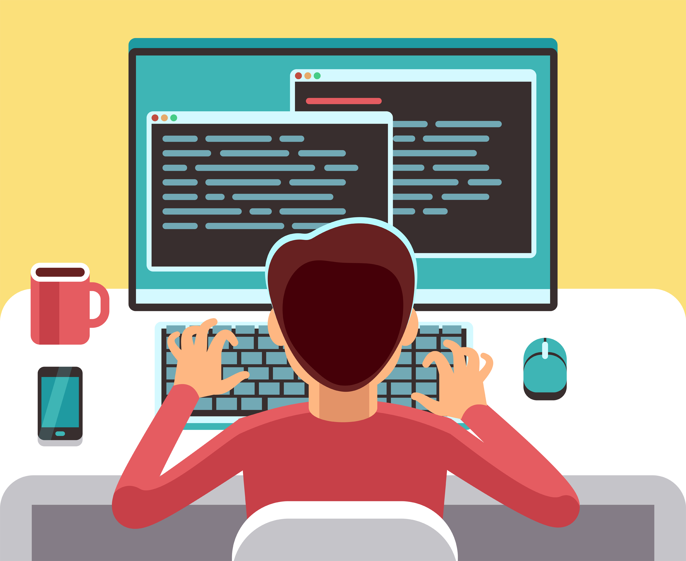

*Coding My Future*

Software engineering has always fascinated me because it merges logical problem-solving with creative design to build impactful solutions. The idea of using technology to solve real-world problems is incredibly motivating and drives my passion for this field. My first exposure to programming came through HTML, CSS, and JavaScript, where I was amazed at how even a few lines of code could transform an idea into something functional. One of my earliest projects, a simple game, challenged me to balance logic with a user-friendly interface. Debugging tricky issues and optimizing performance taught me the importance of persistence and creativity in problem-solving.

## Bridging Software and Hardware

As I’ve progressed in my studies, I’ve developed a strong interest in low-level programming and system optimization. Working with C and Verilog has deepened my appreciation for how software interacts with hardware, especially in writing efficient code. My experience with modular exponentiation, recursion, and MIPS assembly has strengthened my ability to think critically about algorithmic efficiency and computational complexity. Additionally, my work with the Puny Computer architecture has enhanced my understanding of instruction set design and microarchitecture, further fueling my interest in embedded systems and high-performance computing.

## Expanding My Skill Set

Looking ahead, I’m excited to develop expertise in machine learning and artificial intelligence, particularly in building and training models while considering their ethical implications. At the same time, I want to refine my skills in foundational software tools like version control systems, CI/CD pipelines, and scalable development practices. Strengthening my ability to optimize performance and debug complex systems will be essential as I take on more advanced projects.

## Collaboration and Future Impact

Beyond technical skills, I aim to improve my ability to work with interdisciplinary teams. My experience with the UHDT Image Processing subsystem has shown me the importance of teamwork, especially when optimizing high-resolution image processing for GPS calculations. Navigating integration challenges and solving problems under pressure has strengthened my communication skills, but I recognize the need to bridge the gap between technical and non-technical collaborators further.

## A Future in Software Innovation

Ultimately, I want to create software that is not just technically solid but also socially impactful. Whether by improving existing systems, contributing to open-source projects, or designing new innovations, I hope my work reflects creativity and a drive to make a difference. By staying curious, continuously learning, and embracing challenges, I am confident that I can grow into a well-rounded software engineer ready to tackle meaningful problems.

AI was used to check grammar and help organize thoughts into an essay and create the title and subtitles.
