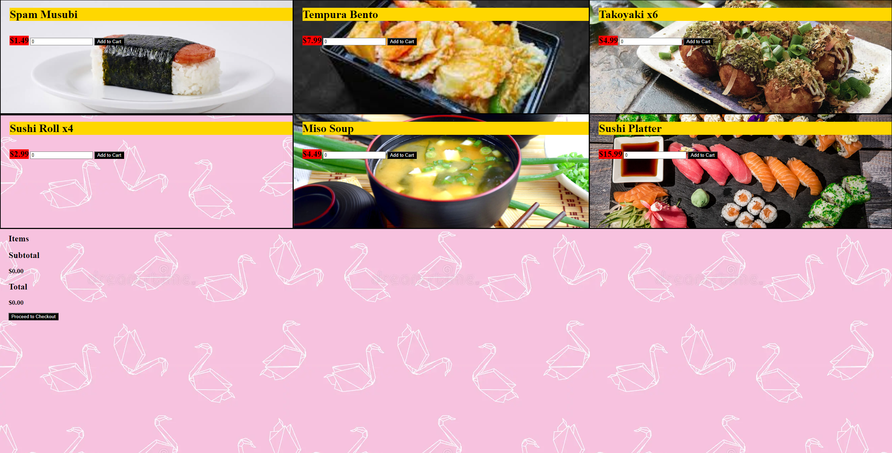

Dodge Em is a browser-based game built using HTML, CSS, and JavaScript. It is an arcade-style survival game where the goal is to last as long as possible. The inspiration for this game comes from many of the classic games I enjoyed as a child.

Through this project, I gained hands-on experience in using HTML, CSS, and JavaScript for game development. However, I encountered several challenges along the way. One major issue was working with raw JavaScript without TypeScript, which led to unpredictable behavior. For example, the game exhibited an unusual problem where it would run correctly on some computers but not on others.

Here is some example CSS code to create the objects in the website:
```css
body {
  overflow-x: hidden;
  overflow-y: auto;
    background-image: url("https://thumbs.dreamstime.com/b/japanese-origami-swan-seamless-linear-pattern-pink-background-54725989.jpg");
  background-size:length;
}
div {
  height:25%;
  width:32.8%;
  position:absolute;
  border: solid;
  padding-left:1%;
}
h1 {
  background-color: gold;
}
#price {
  background-color: red;
  display:inline-block;
}
button {
  background-color:black;
  color: white;
}
#one {
  top:0%;
  left:0%;
  background-image: url("https://www.zippys.com/wp-content/uploads/2019/02/food-sides-Spam-Musubi-04.jpg");
  background-position:center;
  background-size:cover;
}
```
 
Zip file can be provided upon request.
